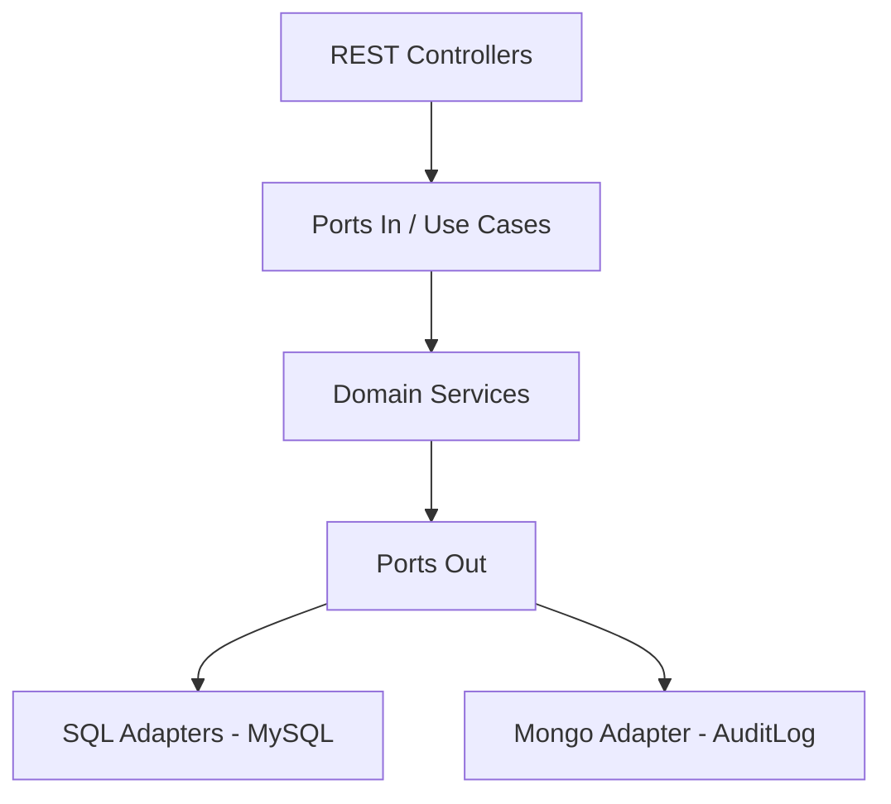
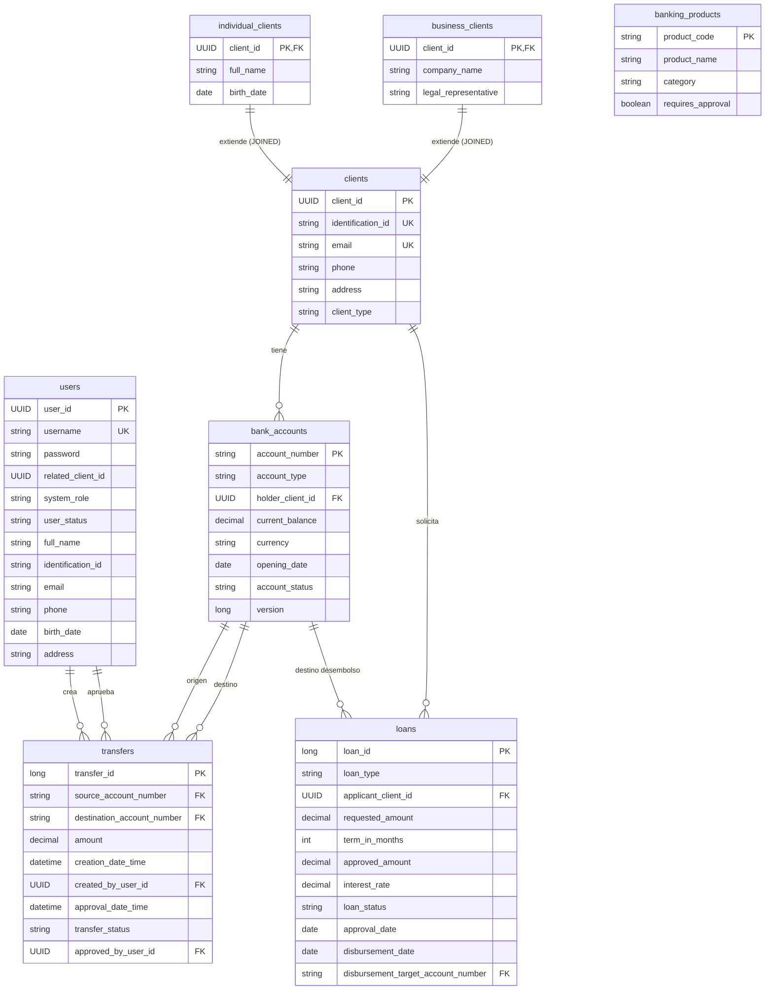
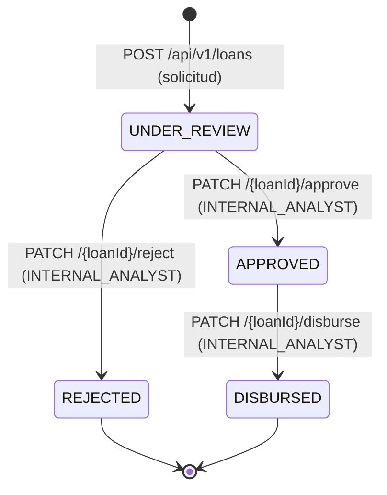
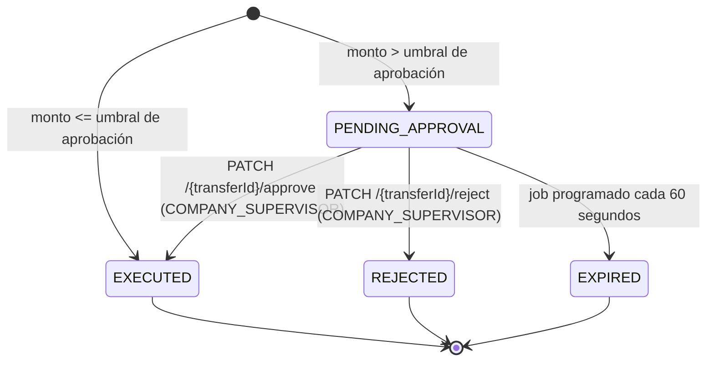

# 🏦 Bank — Sistema de Gestión Bancaria


Sistema bancario académico desarrollado para el curso **Construcción de Software 2** de la **Tecnológico de Antioquia (TdeA)**. Implementa una API REST completa para gestión de clientes, cuentas bancarias, préstamos y transferencias, siguiendo los principios de **Arquitectura Hexagonal** y **Domain-Driven Design (DDD)**.

El proyecto demuestra separación estricta entre dominio, puertos y adaptadores, persistencia dual (MySQL para datos transaccionales + MongoDB para auditoría inmutable), y un modelo de seguridad basado en JWT con 7 roles diferenciados.

---

## 📋 Tabla de contenidos

- [Arquitectura](#arquitectura)
- [Stack tecnológico](#stack-tecnológico)
- [Modelo de datos](#modelo-de-datos)
- [Roles y permisos](#roles-y-permisos)
- [Seguridad](#seguridad)
- [API REST completa](#api-rest-completa)
- [Flujos de negocio](#flujos-de-negocio)
- [Cómo ejecutar](#cómo-ejecutar)
- [Usuarios de prueba](#usuarios-de-prueba)
- [Ejemplos de uso](#ejemplos-de-uso)
- [Testing](#testing)
- [Autor](#autor)

---

## 🏛️ Arquitectura

El proyecto implementa **Arquitectura Hexagonal** (también conocida como Ports & Adapters) combinada con principios de **DDD**. El dominio es completamente independiente del framework: ninguna clase de `domain/` importa Spring ni JPA. La comunicación entre capas se realiza exclusivamente a través de interfaces (puertos).

- **Puertos de entrada** (`ports/in`): interfaces que modelan los casos de uso. Los controllers REST los invocan.
- **Puertos de salida** (`ports/out`): interfaces que abstraen la persistencia. Los adaptadores SQL y MongoDB los implementan.
- **Servicios de dominio** (`domain/services`): implementan la lógica de negocio pura, sin dependencias de infraestructura.
- **Adaptadores** (`infrastructure/adapter`): traducen entre el mundo externo (HTTP, MySQL, MongoDB) y el dominio.



### Estructura de paquetes

| Paquete | Descripción |
|---|---|
| `domain/models` | Agregados y entidades de dominio puro (sin anotaciones de framework) |
| `domain/enums` | Enumeraciones del dominio: `SystemRole`, `LoanStatus`, `TransferStatus`, etc. |
| `domain/ports/in` | Interfaces de casos de uso (puertos de entrada) |
| `domain/ports/out` | Interfaces de repositorio y servicios externos (puertos de salida) |
| `domain/services` | Implementaciones de los casos de uso con lógica de negocio |
| `domain/Exceptions` | Excepciones de dominio tipificadas (`BusinessException`, `InsufficientFundsException`, etc.) |
| `infrastructure/adapter/rest` | Controllers REST, DTOs, mappers y manejador global de excepciones |
| `infrastructure/adapter/sql` | Entidades JPA, repositorios Spring Data JPA y adaptadores SQL |
| `infrastructure/adapter/mongo` | Documento MongoDB, repositorio y adaptador de auditoría |
| `infrastructure/config` | Configuración de Spring Security, beans de infraestructura |
| `infrastructure/seed` | `DataInitializer`: carga usuarios de demo al arrancar (perfil `!test`) |

---

## 🛠️ Stack tecnológico

| Categoría | Tecnología | Versión |
|---|---|---|
| Lenguaje | Java | 17 |
| Framework principal | Spring Boot | 3.2.5 |
| Seguridad | Spring Security + JJWT | Boot 3.2.5 / JJWT 0.12.6 |
| ORM / SQL | Spring Data JPA + Hibernate | Boot 3.2.5 |
| Base de datos SQL | MySQL | 8.3 (Docker) |
| Base de datos NoSQL | MongoDB | 7.0 (Docker) |
| Utilidades | Lombok | 1.18.38 |
| Tests de integración | Testcontainers (MySQL + MongoDB) | 1.20.4 |
| Tests de capa web | Spring Boot Test + Spring Security Test | Boot 3.2.5 |
| Tests unitarios | JUnit 5 + Mockito | Boot 3.2.5 |
| Base de datos en memoria (tests) | H2 (modo MySQL) | Boot 3.2.5 |
| Herramienta de build | Maven Wrapper | - |

---

## 🗄️ Modelo de datos
### Diagrama entidad-relación


**Herencia de clientes:** `ClientEntity` utiliza `@Inheritance(strategy = InheritanceType.JOINED)` con columna discriminadora `client_type`. La tabla `clients` almacena los campos comunes; `individual_clients` y `business_clients` almacenan los campos específicos de cada subtipo en tablas separadas.

### Documento MongoDB — Auditoría

Colección: `audit_logs` (base de datos: `bank_audit`)

| Campo | Tipo | Descripción |
|---|---|---|
| `_id` | String | Identificador generado por MongoDB |
| `entity_type` | String (indexado) | Tipo de entidad afectada, p. ej. `"Loan"`, `"Transfer"`, `"BankAccount"` |
| `entity_id` | String (indexado) | Identificador en texto de la entidad (UUID, número de cuenta, ID de préstamo...) |
| `action` | String | Acción ejecutada, p. ej. `"APPROVED"`, `"DISBURSED"`, `"EXECUTED"`, `"EXPIRED"` |
| `performed_by` | String (indexado) | Identificador del usuario que disparó la acción |
| `occurred_at` | LocalDateTime (indexado) | Momento exacto de la operación |
| `detail` | String (nullable) | Snapshot opcional de la operación en texto |

---

## 👤 Roles y permisos

El sistema define 7 roles en `SystemRole`. Spring Security los registra con el prefijo `ROLE_` y `@PreAuthorize` los evalúa con `hasRole()` / `hasAnyRole()`.

| Rol | Descripción | Capacidades principales |
|---|---|---|
| `INDIVIDUAL_CLIENT` | Cliente persona natural | Solicitar préstamos; ver sus propias cuentas, préstamos y transferencias (ownership filter) |
| `BUSINESS_ADMIN` | Representante de empresa | Solicitar préstamos en nombre de la empresa; mismo acceso de lectura que `INDIVIDUAL_CLIENT` |
| `TELLER_EMPLOYEE` | Empleado de ventanilla | Registrar clientes (individual y empresa); abrir cuentas bancarias; consultar cualquier cliente por identificación |
| `COMMERCIAL_EMPLOYEE` | Empleado comercial | Registrar clientes; abrir cuentas; solicitar préstamos y crear transferencias en nombre del cliente; consultar clientes |
| `COMPANY_OPERATOR` | Operador de empresa | Crear transferencias |
| `COMPANY_SUPERVISOR` | Supervisor de empresa | Aprobar y rechazar transferencias en `PENDING_APPROVAL` |
| `INTERNAL_ANALYST` | Analista interno | Acceso completo de lectura (clientes, cuentas, préstamos, transferencias, auditoría); aprobar, rechazar y desembolsar préstamos |

---

## 🔒 Seguridad

### Flujo JWT

```
1. Cliente  →  POST /api/v1/auth/login  { username, password }
2. Spring Security valida credenciales con BCrypt (BankUserDetailsService)
3. Si válido → servidor genera token JWT (firma HMAC-SHA, secreto configurable)
4. Respuesta: { token, expiresAt, role, userId }
5. Cliente incluye el token en cabeceras posteriores:
   Authorization: Bearer <token>
6. JwtAuthenticationFilter extrae y valida el token en cada request
7. Popula el SecurityContext con userId, username y ROLE_*
```

- **Expiración del token:** 60 minutos (configurable con `bank.jwt.expiration-minutes`).
- **Secreto JWT:** externalizable vía variable de entorno `JWT_SECRET`. El valor por defecto solo debe usarse en desarrollo.
- **Contraseñas:** almacenadas con BCrypt. Nunca se guardan ni registran en texto plano.

### Ownership filtering

Los endpoints de lectura de clientes, cuentas y préstamos utilizan un bean `@authz` personalizado para que un cliente solo pueda acceder a sus propios recursos. Los roles de staff (`INTERNAL_ANALYST`, `TELLER_EMPLOYEE`, `COMMERCIAL_EMPLOYEE`) omiten este filtro.

Ejemplos reales del código:

```java
@PreAuthorize("hasRole('INTERNAL_ANALYST') or @authz.hasAccessToClient(authentication, #clientId)")
@PreAuthorize("hasRole('INTERNAL_ANALYST') or @authz.hasAccessToAccount(authentication, #accountNumber)")
@PreAuthorize("hasRole('INTERNAL_ANALYST') or @authz.hasAccessToLoan(authentication, #loanId)")
```

### Otras consideraciones

- **CORS:** configurado explícitamente en `SecurityConfig` para exponer solo los orígenes permitidos.
- **CSRF:** deshabilitado porque la API es stateless (tokens JWT en cabecera, no cookies de sesión).
- **Enumeración de cuentas:** el endpoint de login no distingue "usuario no existe" de "contraseña incorrecta" para evitar filtración de información.

---

## 🌐 API REST completa

Todas las rutas requieren `Authorization: Bearer <token>` excepto `/api/v1/auth/login`.

### Autenticación

| Método | Ruta | Descripción | Acceso |
|---|---|---|---|
| `POST` | `/api/v1/auth/login` | Obtiene un token JWT | Público |

### Clientes

| Método | Ruta | Descripción | Rol requerido |
|---|---|---|---|
| `POST` | `/api/v1/clients/individual` | Registra un cliente persona natural | `TELLER_EMPLOYEE`, `COMMERCIAL_EMPLOYEE`, `INTERNAL_ANALYST` |
| `POST` | `/api/v1/clients/business` | Registra un cliente empresa | `TELLER_EMPLOYEE`, `COMMERCIAL_EMPLOYEE`, `INTERNAL_ANALYST` |
| `GET` | `/api/v1/clients/{clientId}` | Consulta un cliente por ID | `INTERNAL_ANALYST` o propietario (ownership filter) |
| `GET` | `/api/v1/clients/by-identification/{identificationId}` | Consulta un cliente por cédula / NIT | `INTERNAL_ANALYST`, `TELLER_EMPLOYEE`, `COMMERCIAL_EMPLOYEE` |

### Cuentas bancarias

| Método | Ruta | Descripción | Rol requerido |
|---|---|---|---|
| `POST` | `/api/v1/accounts` | Abre una cuenta bancaria para un cliente existente | `TELLER_EMPLOYEE`, `COMMERCIAL_EMPLOYEE` |
| `GET` | `/api/v1/accounts/{accountNumber}` | Consulta una cuenta por número | `INTERNAL_ANALYST` o propietario (ownership filter) |
| `GET` | `/api/v1/accounts/by-client/{clientId}` | Lista las cuentas de un cliente | `INTERNAL_ANALYST` o propietario (ownership filter) |

### Préstamos

| Método | Ruta | Descripción | Rol requerido |
|---|---|---|---|
| `POST` | `/api/v1/loans` | Solicita un nuevo préstamo (estado inicial: `UNDER_REVIEW`) | `INDIVIDUAL_CLIENT`, `BUSINESS_ADMIN`, `COMMERCIAL_EMPLOYEE` |
| `GET` | `/api/v1/loans/{loanId}` | Consulta un préstamo por ID | `INTERNAL_ANALYST` o propietario (ownership filter) |
| `GET` | `/api/v1/loans/by-client/{clientId}` | Lista los préstamos de un cliente | `INTERNAL_ANALYST` o propietario (ownership filter) |
| `PATCH` | `/api/v1/loans/{loanId}/approve` | Aprueba un préstamo en `UNDER_REVIEW` | `INTERNAL_ANALYST` |
| `PATCH` | `/api/v1/loans/{loanId}/reject` | Rechaza un préstamo en `UNDER_REVIEW` | `INTERNAL_ANALYST` |
| `PATCH` | `/api/v1/loans/{loanId}/disburse` | Desembolsa un préstamo aprobado en la cuenta destino | `INTERNAL_ANALYST` |

### Transferencias

| Método | Ruta | Descripción | Rol requerido |
|---|---|---|---|
| `POST` | `/api/v1/transfers` | Inicia una transferencia (resultado: `EXECUTED` o `PENDING_APPROVAL`) | `COMPANY_OPERATOR`, `COMMERCIAL_EMPLOYEE`, `INDIVIDUAL_CLIENT`, `BUSINESS_ADMIN` |
| `GET` | `/api/v1/transfers/{transferId}` | Consulta una transferencia por ID | `INTERNAL_ANALYST`, `TELLER_EMPLOYEE`, `COMMERCIAL_EMPLOYEE` |
| `GET` | `/api/v1/transfers/by-account/{accountNumber}` | Lista transferencias originadas en una cuenta | `INTERNAL_ANALYST` o propietario (ownership filter) |
| `GET` | `/api/v1/transfers/by-user/{userId}` | Lista transferencias creadas por un usuario | `INTERNAL_ANALYST` |
| `PATCH` | `/api/v1/transfers/{transferId}/approve` | Aprueba una transferencia en `PENDING_APPROVAL` y ejecuta el movimiento | `COMPANY_SUPERVISOR` |
| `PATCH` | `/api/v1/transfers/{transferId}/reject` | Rechaza una transferencia en `PENDING_APPROVAL` sin mover fondos | `COMPANY_SUPERVISOR` |

### Auditoría

| Método | Ruta | Descripción | Rol requerido |
|---|---|---|---|
| `GET` | `/api/v1/audit/by-entity?entityType=&entityId=` | Lista entradas de auditoría para una entidad específica | `INTERNAL_ANALYST` |
| `GET` | `/api/v1/audit/by-user?performedBy=` | Lista entradas de auditoría realizadas por un usuario | `INTERNAL_ANALYST` |

---

## 🔄 Flujos de negocio

### Ciclo de vida de un préstamo



1. Un cliente, administrador de empresa o empleado comercial solicita el préstamo. El préstamo queda en `UNDER_REVIEW`.
2. Un `INTERNAL_ANALYST` lo aprueba (fijando monto aprobado, tasa de interés y fecha) o lo rechaza.
3. Si fue aprobado, el `INTERNAL_ANALYST` puede desembolsarlo, acreditando el monto en la cuenta destino especificada.

### Ciclo de vida de una transferencia



- **Aprobación por alto monto:** al crear una transferencia se envía un `approvalThreshold`. Si el monto supera ese umbral, la transferencia queda en `PENDING_APPROVAL` y requiere que un `COMPANY_SUPERVISOR` la apruebe o rechace.
- **Vencimiento automático:** un job programado (`ExpirePendingTransfersService`) se ejecuta cada 60 segundos y marca como `EXPIRED` todas las transferencias en `PENDING_APPROVAL` cuya `creationDateTime` supere la ventana de 60 minutos (`bank.transfers.expiration-window-minutes`). Ambos parámetros son configurables en `application.properties`.
- Cada cambio de estado genera una entrada en el log de auditoría MongoDB.

---

## ⚙️ Cómo ejecutar

### Prerrequisitos

- JDK 17+
- Docker Desktop (recomendado) **o** MySQL 8 + MongoDB 7 nativos

### Opción A — Con Docker (recomendado)

```powershell
# Desde la carpeta bank/ (donde está el docker-compose.yml)
cd "ConstruccionDeSoftware2\bank"
docker compose up -d

# Verificar que los contenedores estén sanos
docker compose ps

# Iniciar la aplicación (desde la misma carpeta bank/)
.\mvnw.cmd spring-boot:run
```

La aplicación arranca en **http://localhost:8081**.

Los contenedores creados son:

| Contenedor | Imagen | Puerto | Base de datos |
|---|---|---|---|
| `bank-mysql` | `mysql:8.3` | `3306` | `bankdb` |
| `bank-mongo` | `mongo:7` | `27017` | `bank_audit` |

Para detener los contenedores:

```powershell
docker compose down
```

### Opción B — Bases de datos nativas

Asegúrate de tener MySQL 8 y MongoDB 7 corriendo en los puertos por defecto (`3306` y `27017`). Las credenciales por defecto esperadas son `root/root` para MySQL.

```powershell
cd "ConstruccionDeSoftware2\bank"
.\mvnw.cmd spring-boot:run
```

Si necesitas sobrescribir la configuración, usa variables de entorno:

```powershell
$env:DB_HOST = "localhost"
$env:DB_PORT = "3306"
$env:DB_NAME = "bankdb"
$env:DB_USERNAME = "root"
$env:DB_PASSWORD = "root"
$env:MONGO_URI = "mongodb://localhost:27017/bank_audit"
$env:JWT_SECRET = "mi-secreto-de-produccion-minimo-256-bits"
.\mvnw.cmd spring-boot:run
```

### Ejecutar solo los tests

```powershell
cd "ConstruccionDeSoftware2\bank"
.\mvnw.cmd test
```

Los tests de integración SQL usan **H2 en modo MySQL** (sin Docker). Los tests de integración MongoDB requieren que el servidor MongoDB esté corriendo en `localhost:27017`. Los tests de capa web (`@WebMvcTest`) usan mocks y no requieren bases de datos.

---

## 👥 Usuarios de prueba

Al arrancar la aplicación (fuera del perfil `test`), `DataInitializer` crea automáticamente los siguientes usuarios si no existen. Son exclusivamente para entornos de desarrollo y pruebas locales.

| Username | Contraseña | Rol | Descripción |
|---|---|---|---|
| `cliente` | `Cliente123!` | `INDIVIDUAL_CLIENT` | Cliente persona natural demo |
| `empresa` | `Empresa123!` | `BUSINESS_ADMIN` | Representante de empresa demo |
| `cajero` | `Cajero123!` | `TELLER_EMPLOYEE` | Empleado de ventanilla demo |
| `comercial` | `Comercial123!` | `COMMERCIAL_EMPLOYEE` | Empleado comercial demo |
| `operador` | `Operador123!` | `COMPANY_OPERATOR` | Operador de empresa demo |
| `supervisor` | `Supervisor123!` | `COMPANY_SUPERVISOR` | Supervisor de empresa demo |
| `analista` | `Analista123!` | `INTERNAL_ANALYST` | Analista interno demo |

> **Nota:** estas credenciales son únicamente para desarrollo local. No utilizar en ambientes de producción.

---

## 💻 Ejemplos de uso

### Login y obtención de token

```powershell
$response = Invoke-RestMethod -Method POST `
  -Uri "http://localhost:8081/api/v1/auth/login" `
  -ContentType "application/json" `
  -Body '{ "username": "analista", "password": "Analista123!" }'

$token = $response.token
Write-Host "Token: $token"
Write-Host "Rol: $($response.role)"
Write-Host "Expira: $($response.expiresAt)"
```

### Registrar un cliente individual (rol TELLER_EMPLOYEE, COMMERCIAL_EMPLOYEE o INTERNAL_ANALYST)

```powershell
# Obtener token con el cajero
$login = Invoke-RestMethod -Method POST `
  -Uri "http://localhost:8081/api/v1/auth/login" `
  -ContentType "application/json" `
  -Body '{ "username": "cajero", "password": "Cajero123!" }'

$headers = @{ Authorization = "Bearer $($login.token)" }

Invoke-RestMethod -Method POST `
  -Uri "http://localhost:8081/api/v1/clients/individual" `
  -ContentType "application/json" `
  -Headers $headers `
  -Body '{
    "identificationId": "1234567890",
    "email": "juan@example.com",
    "phone": "+57 300 1234567",
    "address": "Carrera 50 #30-10, Medellin",
    "fullName": "Juan Perez",
    "birthDate": "1990-05-15"
  }'
```

### Consultar auditoría por entidad (rol INTERNAL_ANALYST)

```powershell
$login = Invoke-RestMethod -Method POST `
  -Uri "http://localhost:8081/api/v1/auth/login" `
  -ContentType "application/json" `
  -Body '{ "username": "analista", "password": "Analista123!" }'

$headers = @{ Authorization = "Bearer $($login.token)" }

Invoke-RestMethod -Method GET `
  -Uri "http://localhost:8081/api/v1/audit/by-entity?entityType=Loan&entityId=1" `
  -Headers $headers
```

### Intento sin token — respuesta 401

```powershell
try {
    Invoke-RestMethod -Method GET `
      -Uri "http://localhost:8081/api/v1/clients/by-identification/1234567890"
} catch {
    Write-Host "Estado HTTP: $($_.Exception.Response.StatusCode)"
    # Salida esperada: Estado HTTP: Unauthorized (401)
}
```

---

## 🧪 Testing

### Ejecutar todos los tests

```powershell
cd "ConstruccionDeSoftware2\bank"
.\mvnw.cmd test
```

### Distribución de tests

| Tipo | Clases | Tests |
|---|---|---|
| Modelos de dominio (unit) | 6 | 85 |
| Servicios de dominio (unit + Mockito) | 17 | 72 |
| Integración SQL (H2 modo MySQL, in-memory) | 4 | 43 |
| Integración MongoDB (localhost:27017) | 1 | 8 |
| Controllers (`@WebMvcTest` + mocks) | 5 | 26 |
| Seguridad (`AuthSecurityTest`) | 1 | 8 |
| E2E (`LoanLifecycleE2ETest`) | 1 | 3 |
| Carga de contexto (`BankApplicationTests`) | 1 | 1 |
| **Total** | **36** | **246** |

### Notas sobre la estrategia de tests

- **Tests de dominio:** prueban lógica de negocio pura sin framework. No hay Spring en el classpath.
- **Tests de servicios:** usan Mockito para aislar los servicios de sus dependencias (puertos de salida).
- **Tests de integración SQL:** usan **H2 en modo MySQL** (in-memory, sin Docker). Verifican mappers, repositorios y adaptadores contra un esquema generado por Hibernate automáticamente (`ddl-auto=create-drop`).
- **Tests de integración MongoDB:** se ejecutan contra el servidor MongoDB en `localhost:27017` (perfil `test` apunta a la base `bank_audit_test`). Verifican `AuditLogAdapter`.
- **Tests de controllers:** usan `@WebMvcTest` con Spring Security habilitado y mocks de los casos de uso. Verifican serialización, validación y autorización HTTP.
- **Test E2E:** `LoanLifecycleE2ETest` levanta el contexto completo de Spring con H2 en memoria y ejerce el flujo completo `solicitar → aprobar → desembolsar` llamando directamente a los casos de uso.
- **Test de seguridad:** `AuthSecurityTest` verifica que los endpoints protegidos rechacen requests sin token y que el flujo de login funcione correctamente.
- El perfil `test` desactiva `DataInitializer`, permitiendo que cada test controle sus propios fixtures.

---

## 👨‍💻 Autor

**Juan Francisco Hinestroza**
**Miguel Angel Gonzales Mazo**
Tecnológico de Antioquia (TdeA)
Construcción de Software 2 — 2026
